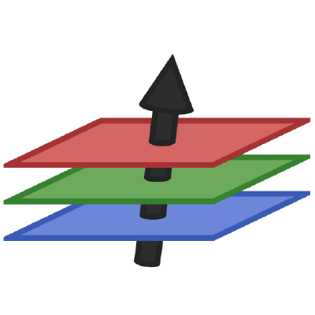

# **👨🏻‍🎓About me...**
    
```python
Arunachala = { 
    "Age" : 17,
    "Status" : "High School Student",
    "Interests" : ["Artificial Intelligence 🧠", "Data Science 📈", "Anime 📺"],
    "Preferences" : {"Langauges":["Python", "C++"],"OS" : "Manjaro", "Editor" : "VSCode"},
    "Hobbies" : ["Competitive Programming 💻", "Volleyball 🏐"],
    "Learning" : ["NLP 📜", "Video Game Programming 👾"],
    "Looking for (Partner)" : "Web/App Developer"
}    
``` 
</div>


# **💾Current projects...**
<br>
<div align = "center">
<a href = "https://github.com/Majimearun/artificial-bi">

</a>
<br>
<a href = "https://github.com/Majimearun/covid-19-data-science-project">

</a>
<br>    
<br>
</div>

# **🔧Techstack...**
<br>
<div align = "center">
<a href='https://keras.io/' target="blank"></a>&nbsp&nbsp&nbsp&nbsp
<a href='https://www.tensorflow.org/' target="blank"></a>&nbsp&nbsp&nbsp&nbsp
<a href='https://skorch.readthedocs.io/en/stable/' target="blank"></a>&nbsp&nbsp&nbsp&nbsp
<a href='https://scikit-learn.org/' target="blank"></a>&nbsp&nbsp&nbsp&nbsp
<a href='https://fluxml.ai/' target="blank"></a>&nbsp&nbsp&nbsp&nbsp
<a href='https://plotly.com/' target="blank"></a>&nbsp&nbsp&nbsp&nbsp
<a href='https://www.python.org/' target="blank"></a>&nbsp&nbsp&nbsp&nbsp
<a href='https://www.cplusplus.com/' target="blank"></a>&nbsp&nbsp&nbsp&nbsp
<a href='https://julialang.org/' target="blank"></a>&nbsp&nbsp&nbsp&nbsp
<a href='https://www.haskell.org/' target="blank"></a>&nbsp&nbsp&nbsp&nbsp
<a href='https://jupyter.org/' target="blank"></a>


</div>
<br>


# **🤝🏻Let's team up!!!**

<p align = "center"> 
    <a href="https://www.linkedin.com/in/arunachala-a-m-9029771b4/" alt="Linkedin"></a>&nbsp&nbsp&nbsp&nbsp&nbsp&nbsp
    <a href="https://twitter.com/MajimeArun" alt="twitter"></a>&nbsp&nbsp&nbsp&nbsp&nbsp&nbsp
    <a href="https://www.facebook.com/arunachala.amudamurugan.1/" alt="twitter"></a>&nbsp&nbsp&nbsp&nbsp&nbsp&nbsp
    
</p>
